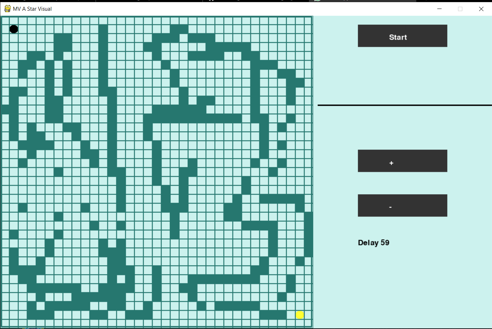

# A-star-finding-algorithm-visualisation( with full comments for understanding)
since the graph algorithm are tough to visualise, so i think its good idea to make something which visual for proper understanding
...A star finding algorithm is know as brain algorithm to find best path between two node like dijstra used for one node to all node
but it is artifical intelligence base algo ( A star)  for algo you can understand from anywhere

Description:

1..Used pygame for making graphics visual

2..Used 2d grid to visualise graph connected on side not diagonal

3..You can adjust initial and final as your wish

4..You can make wall also according to your thinking

5..the best part is delay function , you can see in any speed

---you can change it to any other algo also like dijstra,bfs,dfs by change code to it

For run:

1.. Install python.

2.. install pygame (pip install pygame)

3.. clone it 

4... for ubuntu open terminal there(note at that location) ,, for window open powershell-----type python my_a_star.py

5..now see magic make some wall set delay ..enjoy and understand

